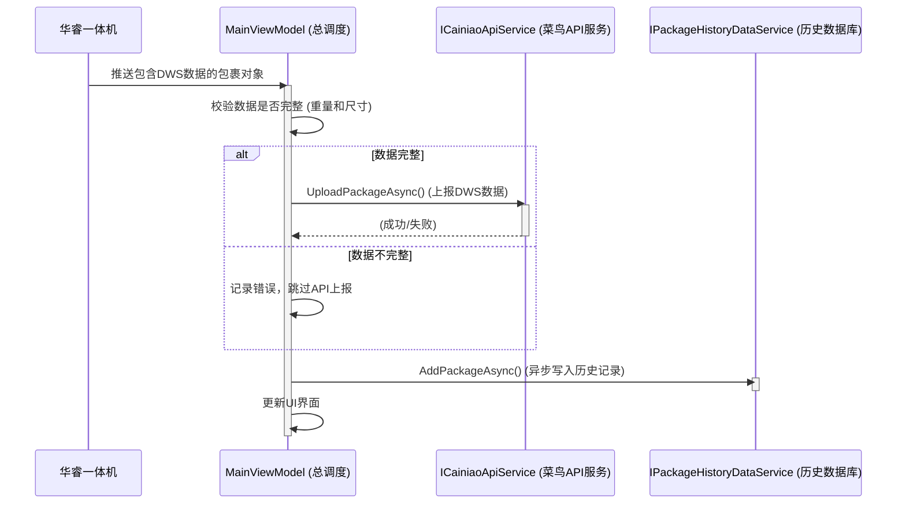

## 洛杉矶快手 (`LosAngelesExpress`) DWS数据采集模块业务文档

### 1. 模块概述

`LosAngelesExpress` (洛杉矶快手) 模块是一个专用于DWS（尺寸、重量、条码）数据采集和单向数据推送的终端系统。其核心功能是自动采集流经设备的包裹信息（DWS数据），然后将这些信息通过一个统一的API接口上报给菜鸟的后端服务器。

### 2. 核心业务流程

本模块的流程非常直接，围绕"自动采集 -> 数据校验 -> 单向上报"三个核心环节。

#### 2.1. 流程图

#### 2.2. 流程文字描述

1.  **自动数据采集与触发**:
    *   整个流程由**华睿DWS一体机**驱动。当包裹通过设备时，该一体机会自动完成条码读取、称重和尺寸测量，然后将一个包含所有DWS数据的完整 `PackageInfo` 对象推送到本系统。
    *   本系统作为接收方，被动地监听来自一体机的包裹数据流。

2.  **数据校验**:
    *   系统收到包裹数据后，会立即检查其有效性，核心是判断**重量**和**三维尺寸**（长、宽、高）是否都大于零。

3.  **单向数据上报**:
    *   **仅当DWS数据完整有效时**，系统才会调用 `UploadPackageAsync` 接口，将包裹的条码、重量（单位：克）、尺寸（单位：毫米）等信息通过一个 `POST` 表单请求，上报给菜鸟的后端服务器。
    *   如果数据不完整，系统会记录一条错误信息，并**跳过**本次API上报。

4.  **结果记录与反馈**:
    *   API调用的结果（成功或失败）会被记录下来。
    *   无论API上报是否执行或成功，每个被采集到的包裹信息最终都会被**异步地写入本地数据库**，用于历史追溯。
    *   同时，主界面会实时更新，展示刚刚处理的包裹数据、处理状态（成功、数据缺失、API失败等）以及滚动的统计信息。

### 3. API 接口定义

#### 3.1. 接口: 上报DWS数据

*   **Endpoint**: 从配置文件中读取 (例如: `http://example.com/api/upload`)
*   **请求方法**: `POST`
*   **Content-Type**: `application/x-www-form-urlencoded`

**表单字段**:

| 字段名               | 类型   | 必填 | 描述                                                         |
| :------------------- | :----- | :--- | :----------------------------------------------------------- |
| `logistics_interface`| String | 是   | 一个JSON字符串，包含了详细的包裹信息。                        |
| `msg_type`           | String | 是   | 消息类型，固定值为 `GLOBAL_SMART_SITE_SIGN_IN_NOTIFY`。      |
| `logistic_provider_id`| String | 是   | 物流提供商ID，固定值为 `wuke_iot`。                          |
| `data_digest`        | String | 是   | 数据摘要（签名），通过 `logistics_interface` 和密钥 `AppSecret` 生成。 |
| `to_code`            | String | 是   | 目标代码，固定值为 `smart_site_am`。                         |

**`logistics_interface` 字段的JSON结构**:

| 字段名          | 类型    | 必填 | 描述                                 |
| :-------------- | :------ | :--- | :----------------------------------- |
| `bizCode`       | String  | 是   | 业务码，即**包裹条码**。             |
| `weight`        | Integer | 是   | 包裹重量，单位：**克 (g)**。          |
| `length`        | Integer | 是   | 包裹长度，单位：**毫米 (mm)**。       |
| `width`         | Integer | 是   | 包裹宽度，单位：**毫米 (mm)**。       |
| `height`        | Integer | 是   | 包裹高度，单位：**毫米 (mm)**。       |
| `warehouseCode` | String  | 是   | 仓库代码，固定值为 `TRAN_STORE_30867964`。 |
| `workbench`     | String  | 是   | 工作台名称，从配置中读取。           |
| `weightUnit`    | String  | 是   | 重量单位，固定值为 `g`。             |
| `dimensionUnit` | String  | 是   | 尺寸单位，固定值为 `mm`。            |

**签名 (`data_digest`) 生成**:
1.  将 `logistics_interface` 的JSON字符串与密钥 `AppSecret` 进行拼接。
2.  对拼接后的字符串进行MD5哈希计算。
3.  将哈希结果转换为Base64字符串。

**成功响应 (200 OK)**:
*   API的响应体是一个JSON字符串，但当前业务逻辑并未解析其内容来获取分拣码等信息，仅通过HTTP状态码判断是否成功。

### 4. 硬件设备要求

#### 4.1. 华睿DWS一体机 (HuaRay DWS Integrated Machine)
*   **作用**: 作为本系统**唯一**的数据来源。它集成了工业相机和处理单元，能独立完成条码读取、称重、尺寸测量，并将结构化的 `PackageInfo` 数据对象主动推送给本软件。
*   **在流程中的角色**: 是整个业务流程的触发器和数据提供者。本模块的稳定运行完全依赖于该设备的正常工作和数据推送。

--- 